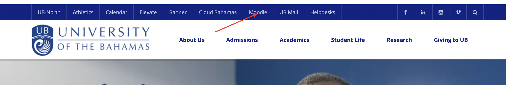
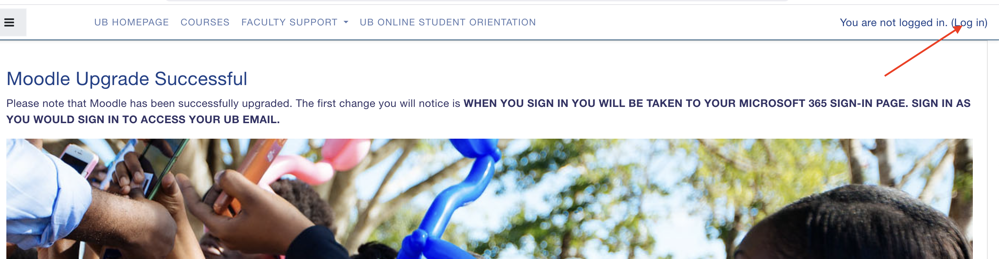
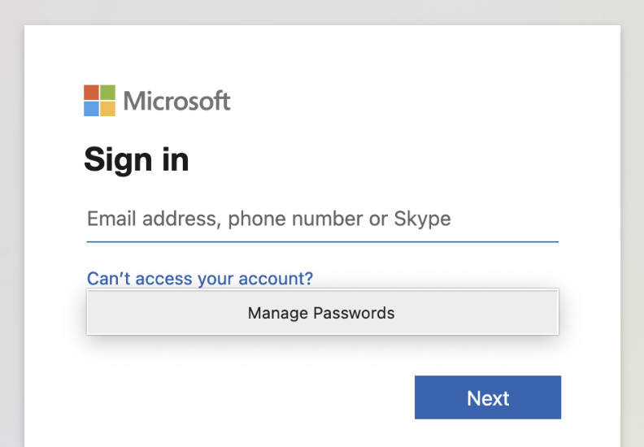
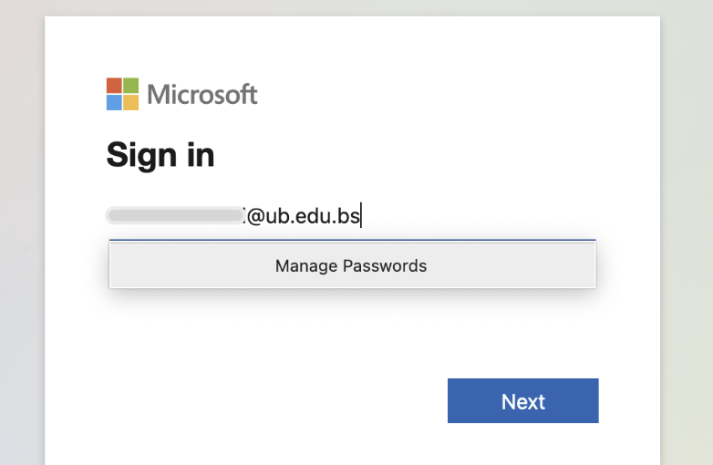
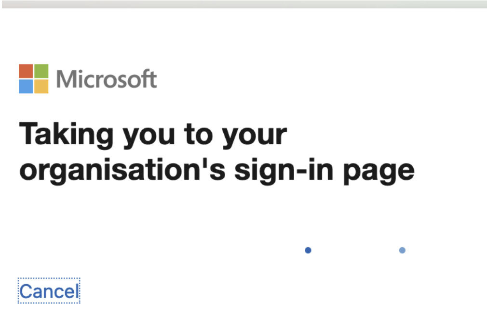
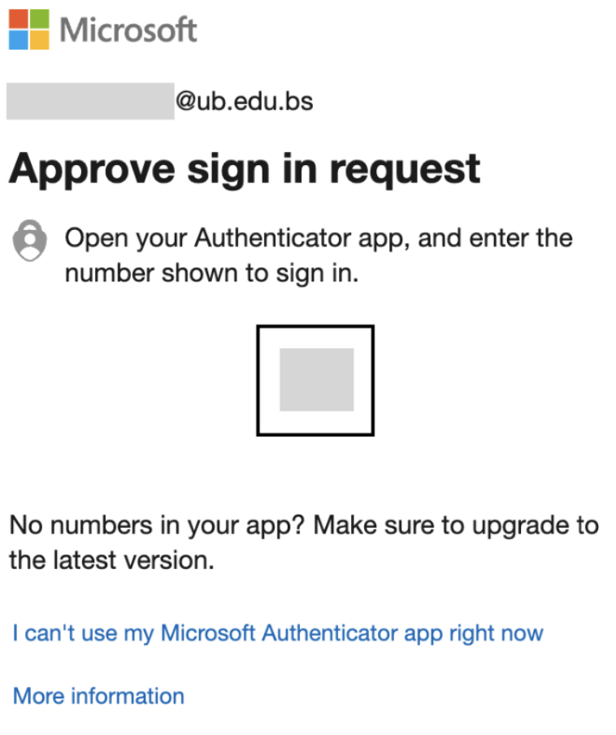
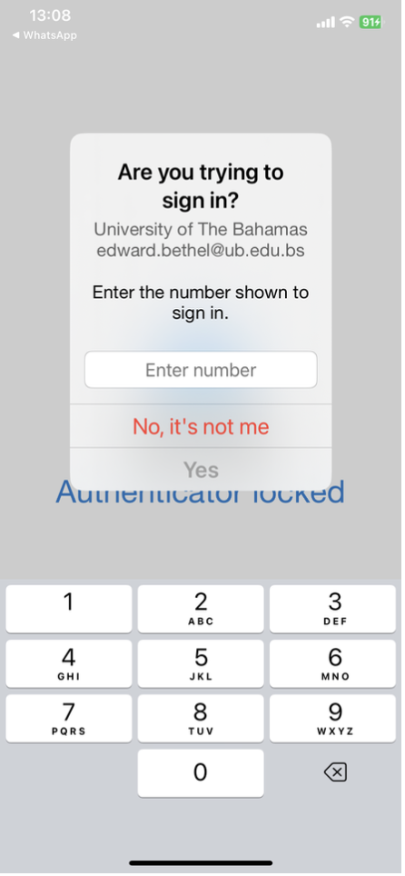

# Getting Started

<div class="chapter-intro">

In this Chapter, we get you started working with Moodle. Doing things like logging in, getting familiar with the dashboard, customizing your profile, etc.

</div>

## Login to Moodle

1. The first thing you need to do is to access Moodle from the Moodle Home page:
```{r echo=FALSE, fig.cap = 'Navigate to Moodle from the UB Homepage'}
   
```

2. At the Moodle HomePage, click "Login" at the top right of the screen:
```{r echo=FALSE, fig.cap = 'Login to Moodle'}
   
```

## Authenticate using LDAP

3. You will now have to authenticate through the active directory LDAP. When you click Login from Moodle, you are taken to the Office 365 login page:
```{r out.width = "50%", echo=FALSE, fig.cap = 'Navigate to Moodle from the UB Homepage'}
   
```
<br><br>
4. Sign in with your UB-issued email:
```{r out.width = "50%", echo=FALSE, fig.cap = 'Use your UB email to sign in'}
   
```
<br><br>
5. You will be taken to UB Office 365 sign-on page:
```{r out.width = "50%", echo=FALSE, fig.cap = 'Popup taking you to UB sign in page'}
   
```
<br><br>
6. Use your UB Password to sign in from the university sign-in page:
```{r echo=FALSE, fig.cap = 'The UB Office 365 sign-in page'}
  knitr::include_graphics("images/Chapter_2/UB_Sign_In.png") 
```
<br><br>
7. Confirm your identity using the mobile Authenticator app ([iOS](https://apps.apple.com/us/app/microsoft-authenticator/id983156458), [Google Play](https://play.google.com/store/apps/details?id=com.azure.authenticator&hl=en&pli=1)):
```{r out.width = "50%", echo=FALSE, fig.cap = 'Instrutions to approve your sign in'}
   
```
<br><br>
8. Approve your sign in by typing the number shown on your approve request in the Authenticator:
```{r out.width = "50%", echo=FALSE, fig.cap = 'Approve your sign in by typing the number in the Authenticator'}
  
```

